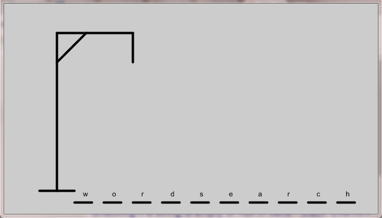
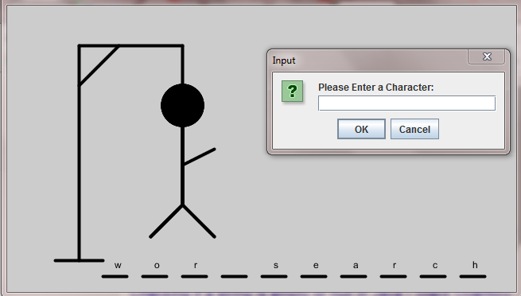

## Hangman 

This is a simple hangman implementation in processing. Change the first array(`wordList`) to add or remove more words. The maximum length of the words is 10.\

Everytime you run the program, a word will be randomly selected from the list. 

Following the standard rules of hangman - 6 mistakes and you hang the man, ie. you lose.

Some screen shots

